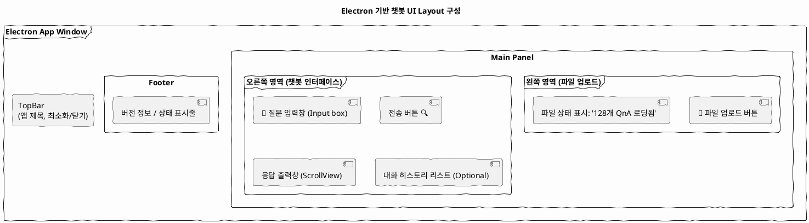

# 1. 구조

## 1-a) 사용자 예상 시나리오

  ```plantuml
    @startuml
    title Electron + ChatGPT 기반 챗봇 - 사용자 액티비티 다이어그램

    start

    :Electron 앱 실행;

    :CSV 또는 Excel 파일 업로드;

    if (파일 유효성 검사) then (성공)
      :Python 서버에 파일 전송;
      :Pandas로 파싱 → QnA 또는 context 추출;
      :중요 정보 메모리에 저장;
    else (실패)
      :오류 메시지 출력;
      stop
    endif

    :사용자 질문 입력;

    repeat
      :질문 내용 + context 구성;
      :ChatGPT API 호출 (질문 + 관련 QnA 포함);
      :AI 응답 생성;
      :응답 결과 Electron에 표시;
    repeat while (사용자가 계속 질문함?)

    :앱 종료 또는 반복 사용;

    stop
    @enduml
  ```

## 1-b) Electron + Python 챗봇 구조

- 일렉트론 프로그램을 클릭하면 python 서버도 동시 실행  
- 일렉트론으로 개발한 프로그램에서 csv 파일 경로를 선택  
- 선택된 파일 서버 전달, 후 처리 진행  

    ```plantuml
    @startuml
    title Electron 기반 챗봇 구조 (CSV/Excel 입력 기반)

    actor User
    participant "Electron\n(프론트엔드)" as Electron
    participant "Python Server\n(Flask or FastAPI)" as Python
    participant "Pandas/TF-IDF\n처리 모듈" as NLP

    == 데이터 업로드 ==
    User -> Electron : CSV 또는 Excel 파일 선택
    Electron -> Python : POST /upload (파일 전송)
    Python -> NLP : 파일 파싱 및 QnA 리스트 생성
    NLP -> Python : QnA 리스트 메모리 저장
    Python --> Electron : 업로드 완료 응답

    == 질문 입력 ==
    User -> Electron : 질문 입력
    Electron -> Python : POST /ask {"question": "..."}
    Python -> NLP : 질문과 기존 질문 간 유사도 비교 (TF-IDF)
    NLP -> Python : 가장 유사한 답변 추출
    Python --> Electron : {"answer": "..."}
    Electron -> User : 응답 출력

    @enduml

    ```

## 1-c) electron UI 구성


